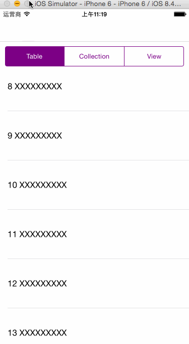

#MBXPageViewController

---
fork https://github.com/Moblox/MBXPageViewController,因为demo用的xib，这里是去掉xib文件修改代码的一个Demo。

---

A library that allows to have a UIPageController with control buttons (One per VC / Left-Right Buttons) or an UISegmentController. This is not a difficult task, but the intention of this library is to make it extremely easy, clean and fast. We resemble the use of a UITableView in a UIViewController.


<!--## How it looks
### Free Buttons

### Left/ Right Arrow Buttons
-->

### SegmentController Buttons


## Features
### Page Modes
- MBX_FreeButtons: Add as many buttons as Viewcontrollers. You can jump to an specific ViewController with that Button or you can swipe your way through
- MBX_LeftRightButtons: Use two buttons to move left or right through the ViewControllers.
- MBX_SegmentController: Use a SegmentController to move between the ViewControllers.


## What can I include in the ViewControllers
- UITableViewControllers
- UICollectionViewControllers
- UIViewControllers
- Pretty much anything!


### Adding the Files

Add MBXPageViewController.h / .m to your project and you are ready to go.

## Examples

You can find examples for the three different ways to use this (Free Buttons, Left Right or with an UISegmentController) in the project.

## Code Example

```
#import "MBXSegmentControllerExampleViewController.h"
#import "MBXPageViewController.h"

@interface MBXSegmentControllerExampleViewController () <MBXPageControllerDataSource, MBXPageControllerDataDelegate>
@property (strong, nonatomic) UISegmentedControl *segmentController;
@property (strong, nonatomic) UIView *containerView;
@property (strong, nonatomic) MBXPageViewController* MBXPageController;

@end

@implementation MBXSegmentControllerExampleViewController

- (void)viewDidLoad {
    [super viewDidLoad];
    
    // Initiate MBXPageController
    self.MBXPageController = [[MBXPageViewController alloc] init];
    self.MBXPageController.MBXDataSource = self;
    self.MBXPageController.MBXDataDelegate = self;
    self.MBXPageController.pageMode = MBX_SegmentController;
    [self.MBXPageController reloadPages];
}


#pragma mark - MBXPageViewController Data Source

- (NSArray *)MBXPageButtons
{
    if (!_segmentController) {
        _segmentController = [[UISegmentedControl alloc]initWithItems:@[@"Table",@"Collection",@"View"]];
        _segmentController.frame = CGRectMake(10, 64+10, self.view.bounds.size.width-20, 40);
        _segmentController.tintColor = [UIColor purpleColor];
        _segmentController.selectedSegmentIndex = 0;
        [self.view addSubview:_segmentController];
    }
    return @[_segmentController];
}

- (UIView *)MBXPageContainer
{
    if (!_containerView) {
        _containerView = [[UIView alloc] init];
        _containerView.backgroundColor = [UIColor whiteColor];
        _containerView.frame = CGRectMake(0, 64+10+40+10, self.view.bounds.size.width, self.view.bounds.size.height-64+10+40+10);
        [self.view addSubview:_containerView];
    }
    return _containerView;
}


- (NSArray *)MBXPageControllers
{
    MBXTableViewController *tabViewController = [[MBXTableViewController alloc] init];
    MBXCollectionViewController *collectionViewController = [[MBXCollectionViewController alloc] init];;
    UIViewController *viewController = [[UIViewController alloc] init];
    viewController.view.backgroundColor = [UIColor orangeColor];
    return @[tabViewController,collectionViewController, viewController];
}


#pragma mark - MBXPageViewController Delegate

- (void)MBXPageChangedToIndex:(NSInteger)index
{
    NSLog(@"%@ %ld", [self class], (long)index);
}

```


MBXPageViewController
=====================

The MIT License (MIT)

Copyright (c) 2014 Moblox

Permission is hereby granted, free of charge, to any person obtaining a copy
of this software and associated documentation files (the "Software"), to deal
in the Software without restriction, including without limitation the rights
to use, copy, modify, merge, publish, distribute, sublicense, and/or sell
copies of the Software, and to permit persons to whom the Software is
furnished to do so, subject to the following conditions:

The above copyright notice and this permission notice shall be included in all
copies or substantial portions of the Software.

THE SOFTWARE IS PROVIDED "AS IS", WITHOUT WARRANTY OF ANY KIND, EXPRESS OR
IMPLIED, INCLUDING BUT NOT LIMITED TO THE WARRANTIES OF MERCHANTABILITY,
FITNESS FOR A PARTICULAR PURPOSE AND NONINFRINGEMENT. IN NO EVENT SHALL THE
AUTHORS OR COPYRIGHT HOLDERS BE LIABLE FOR ANY CLAIM, DAMAGES OR OTHER
LIABILITY, WHETHER IN AN ACTION OF CONTRACT, TORT OR OTHERWISE, ARISING FROM,
OUT OF OR IN CONNECTION WITH THE SOFTWARE OR THE USE OR OTHER DEALINGS IN THE
SOFTWARE.
